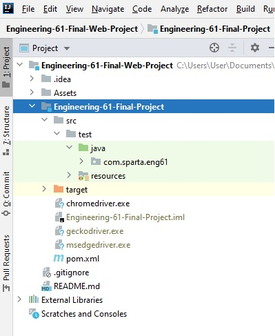
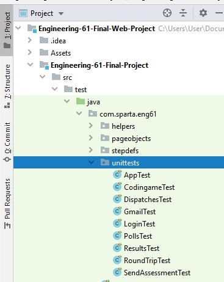
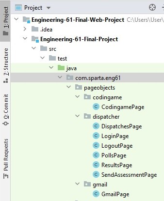

# Engineering-61 Final Project

This framework has been built to test an application for the candidate assessment process at Sparta Global. Using selenium to build this framework we have automated test execution and engineered a reusable framework for testers to use. 


## Prerequisites

The first step in using this framework is to clone the repository. Then open the framework in your IDE. Following the prerequisites below will allow you to work with the framework: 


### Preparing Properties File

To use this framework, you will need to create a properties file in your resources folder to call all your credentials to login to the pages.

- Name your properties file: **credentials.properties**

Below is an example of how you should write your credentials in the properties file.
```
username=yourAdminUsername
password=adminPassword
candidatename=Candidate Name
candidateemail=candidate@email.com
candidatepassword=CandidateEmailPassword
recruiteremail= recruiter@email.com
recruiterpassword= recruiterEmailPassword
```
In the project there is a class called Propertiesloader in the helpers’ package, this class will handle the return of the credentials from the properties file.


 ```java 
PropertiesFileLoader properties = new PropertiesFileLoader();
properties.getCandidateEmail();

 ```

### Preparing Web Driver

In the project there is a class called WebDriverFactory in the helpers’ package, this class will handle the return of the Webdrivers for different browsers such as Chrome, Firefox and Edge browser.

-  To use the web driver, you would need to download the driver for each browser, there is link to the driver in the section Built With.

- Put the exe driver file in the Engineering-61-Final-Project folder shown highlighted in the image below



- The code below shows how to use the different web driver for each browser

```java 
WebDriver webDriver = WebDriverFactory.selectDriver(“Firefox”);

WebDriver webDriver = WebDriverFactory.selectDriver(“Chrome”);

WebDriver webDriver = WebDriverFactory.selectDriver(“Edge”);
 ```

## Using the Framework

The Assessment Dispatcher framework is very simple and will allow you to use methods already created to run your tests. Here are a few ways you could use the framework:

### Unit Testing

To test components of the website in isolation our framework has pre-existing methods that you can call. For example, if I wanted to test that the error message has the correct spelling. All it would is your expected answer to be the correct spelling and our method for checking the header, this is shown below:
```java
WebDriver webDriver = WebDriverFactory.selectDriver(“Firefox”);
LoginPage loginPage = new LoginPage(webDriver);

@Test
public void loginErrorMessageTest(){
Assertions.assertTrue(true, loginPage.isTokenErrorMessageCorrect);
}
```
Each webpage has its own Page Object Model, which contains methods that can be used to test components of the webpage. Any test classes created for unit testing should be placed in the ‘unittesting' package.

*Unit testing package picture.




### Using Test Runner

Another feature of this framework is the ability to use Cucumber and BDD. By using the correct tags within the test runner class, you can decide what features and scenarios you would like to test. 

To do this ordinarily you would need to load each method that allows you to get to the point of running the test, but with the correct tag you can run the correct scenario and the framework will do the rest. 

For example, if you would like to test if the update button clicks on the results page. You can use the @... tag.

```java
@RunWith(Cucumber.class)
@CucumberOptions(
        plugin = {"pretty",
                "html:target/reporting/report.html",
                "json:target/reporting/report.json",
                "junit:target/reporting/report.xml"},
        tags = "@UpdateButtonFunction",
        stepNotifications = true,
        dryRun = false
)
public class TestRunner {

}
```
Here is a list of the tags that you can use in our framework:

```
@TestWithPsychometric
@TestWithoutPsychometric
@OnlyPsychometricTest
@SendingCandidateEmail
@EmailHasCodingGameLink
@CandidateNameAddedToDispatches
@CandidateEmailAddedToDispatches
@EnterFirstQuestionAnswer
@EnterSecondQuestionAnswer
@EnterThirdQuestionAnswer
@EnterFourthQuestionAnswer
@EnterFourthQuestionAnswer
@SubmitTest
@CompletedTest
@IncompleteTest
@TestNotExpired
@TestExpired
@BothCredentialsCorrect
@BothCredentialsWrong
@BlankCredentials
@IncorrectUsername
@IncorrectPassword
@LogOutFromSendAssessmentPage
@LoggingOutFromDispatcherPage
@LoggingOutFromResultsPage
@LoggingOutFromPollsPage
@CheckWaitingStatus
@CheckCompletedStatus
@CheckExpiredStatus
@PollTimeUpdate
@CheckTestIDPresent
@CheckEmailAddressPresent
@RecruiterEmailPresent
@ScoreForCandidateAssessment
@EmailCorrectInResultsPage
@EachNameDisplayedInResultsPage
@CandidateNRDisplayed
@CandidateLRDisplayed
@UpdateButtonFunctions
@FieldForCandidateName
@FieldForCandidateEmail
@FieldForRecruiterEmail
@SelectingPsychometricAssessment
@NumberOfAssessments
@SendingAssessment
@EnterCandidateName
@EnterCandidateEmail
@TimeAssessmentSentToCandidate
```

### Round Trip

The framework is also capable of running a full cycle trip. This means that the program will go onto the Dispatcher website, send an assessment to a candidate email, log on to the candidate email, do the test then go back to the Dispatcher website and update the results to find the candidates test. 

Using this method will require you to fill in the correct information into the properties file, so that when the method runs it will enter that information automatically. 

## Contributing

To contribute on this project, if you want to contribute to the project and make it better, your help is very welcome. helpful bug reports, feature requests and the noblest of all contributions: a good, clean pull request.

### How to make a clean pull request

Project's contribution instructions. To follow

- Create a personal fork of the project on GitHub.
- Clone the fork on your local machine. Your remote repo on GitHub is called `origin`.
- Add the original repository as a remote called `upstream`.
- If you created your fork a while ago be sure to pull upstream changes into your local repository.
- Create a new branch to work on! Branch from `dev` or `master`
- Implement/fix your feature, comment your code.
- Follow the code style of the project, including indentation & correct naming convention.
- If the project has tests run them!
- Write or adapt tests as needed.
- Push your branch to your fork on GitHub, the remote `origin`.
- From your fork open a pull request in the correct branch. Target the project's `develop` branch or go for `master`!
- Once the pull request is approved and merged you can pull the changes from `upstream` to your local repo and delete
your extra branch(es).

And finally: Always write your commit messages in the present tense. 
Your commit message should describe what the commit, when applied, does to the code – not what you did to the code.

#### Correct naming convention

```
e.g. 
Name-ClassFeature-DATE.
Bob-LoginPageErrorMessage-11082020.
```


## Creating A New Page Object Model (POM) for testing
It is important that before creating methods for testing you create your own page object model. This ensures that none of the previously written methods are affected by any of your implementation. 

The class should be placed within a package named after the page you are working on and placed within the pageobjects package. 
The name of your pom should be the same as the name of the webpage it is interacting with plus `page`, using camel case. An example of the project structure and naming is given below:



To create methods in the page object model, use the `By` command from Selenium to call the specific elements in the web page. It is advised to first try the following `By` commands respectively:
```java
By elementAction = new By.ByClassName("class");
By elementAction = new By.ById("id");
By elementAction = new By.ByName("name");
By elementAction = new By.ByLinkText("linkText");
By elementAction = new By.ByPartialLinkText("partialLinkText");
By elementAction = new By.ByCssSelector("cssSelector");
By elementAction = new By.ByXpath("xpath");
```

If you are unable to figure out the correct path through inspecting the element, you can use the tool `Selenium IDE` to record yourself using the webpage. It will then show you a list of the paths it used to access the element. Allowing them to be used for the `By` commands.

Once the page object model is populated:

- Add the unit test to the`unittests` package by creating a new class (WEBSITENAME+`tester`).
- Create and Modify the Credential.properties from the resources package.
- Use the resources package to create scenarios with Gherkin syntax in a new feature file (WEBSITENAME+`.feature`) for the page object models.
- Add the stepdef file (WEBSITENAME+`Stepdef`) in the stepdef package to call the gherkin syntax from the feature file to be called. 
- Tag your scenarios so that they can be called within the test runner.

The test runner then allows the user to run the specific test methods required.


## Built With
* [Maven](https://maven.apache.org/) - Dependency Management
#### Dependencies
* [Junit](https://mvnrepository.com/artifact/org.junit.jupiter/junit-jupiter-api/5.6.2)
 * [Selenium Java](https://mvnrepository.com/artifact/org.seleniumhq.selenium/selenium-java/3.141.59/)
 * [Cucumber Java](https://mvnrepository.com/artifact/io.cucumber/cucumber-java/6.2.0)
 * [Cucumber Junit]( https://mvnrepository.com/artifact/io.cucumber/cucumber-junit/6.2.0)
#### Drivers
 * [Chrome Driver](https://chromedriver.chromium.org/downloads)
 * [Firefox Driver](https://github.com/mozilla/geckodriver/releases)
 * [Edge Driver]( https://developer.microsoft.com/en-us/microsoft-edge/tools/webdriver/)

#### Tools
* [Selenium IDE](https://www.selenium.dev/selenium-ide)
* [Intellij]( https://www.jetbrains.com/idea)
* [GitHub]( https://github.com/MahamudHub/Engineering-61-Final-Web-Project)


## Authors

* **Arunabha Roy Chowdhury** - [ArunabhaRC]( https://github.com/ArunabhaRC)
* **Elizabeth Edge** - [lizzieedge21]( https://github.com/lizzieedge21)
* **Mohamed Mahamud** - [MahamudHub]( https://github.com/MahamudHub)
* **Shariar Halim** - [HalimSh]( https://github.com/HalimSh)
* **Sumaya Mahamed** - [S-Mahamed]( https://github.com/S-Mahamed)


## Acknowledgments

Special Thanks to Darrell Grainger for supplying us with a method to see if the element has changed path. 
 
Special Thanks to Manish Gadhvi for being a great scrum master and helping us whenever we needed it. 
 
Special Thanks to Richard Gurney for giving us a live project to work on.

